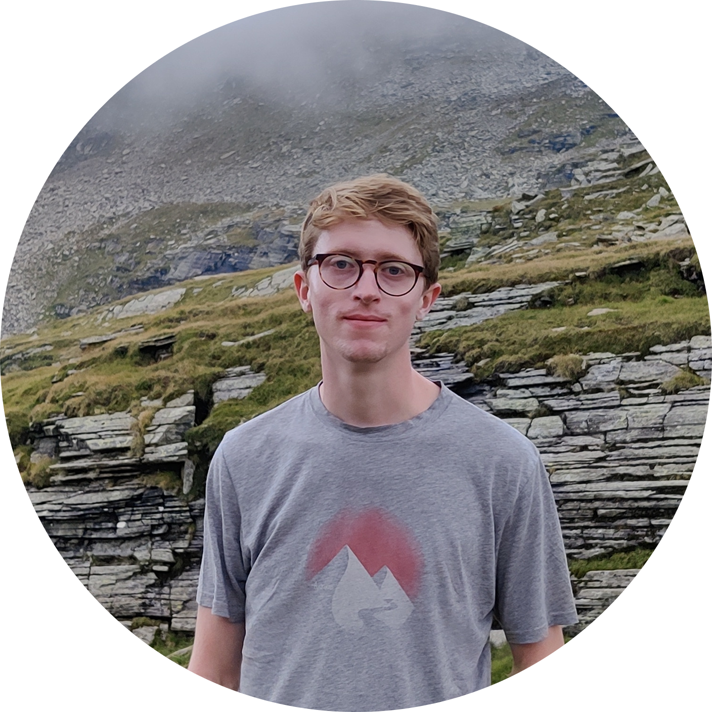

---
# Feel free to add content and custom Front Matter to this file.
# To modify the layout, see https://jekyllrb.com/docs/themes/#overriding-theme-defaults

layout: home
# title: Home
---

## Hi there, I'm Jochem Verstegen
I am an Industrial Design student at [Eindhoven University of Technology](https://www.tue.nl/en/our-university/departments/industrial-design/), currently I'm in my second year of the bachelor. I am passionate about smart technology and designing to help people understand complex systems and adopt new technologies.

Welcome to my portfolio! I am currently working on it, so it is far from finished. Feel free to have a look and be sure to check back later to see if I added some more content! Eventually, I'm planning on making my own theme for this website and sorting the information based on relevancy to different competencies or subjects.