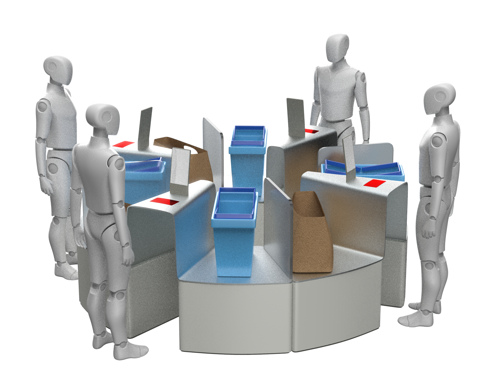
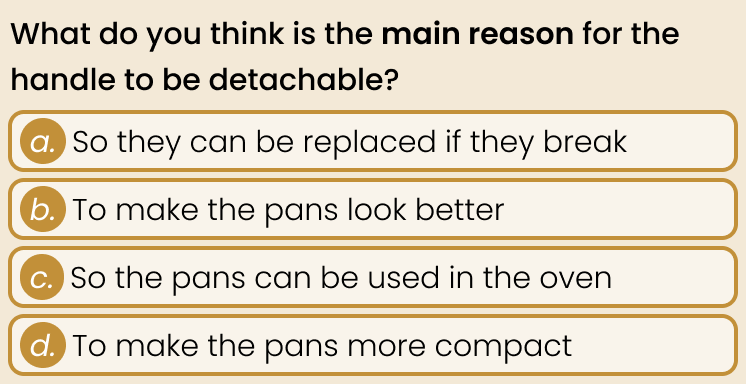
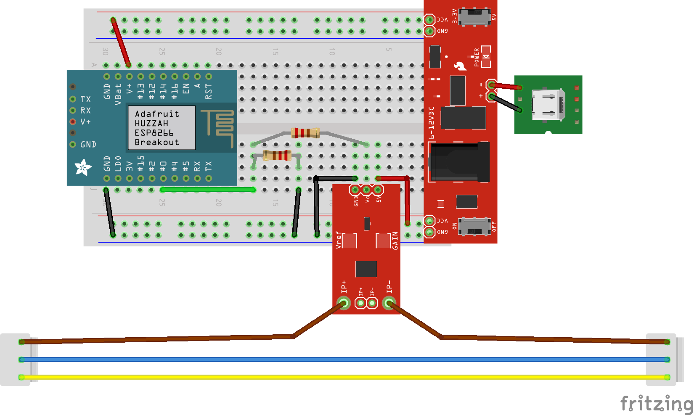

# Bachelor’s
During my TU/e ID Bachelor's, I focused on connected, automated technology, developing a vision to simplify complex systems. Smart home became my passion, prompting me to continue with an ID Master’s with the RDD track.

I grew in all expertise areas, particularly T&R and C&A, gaining skills in UX, design processes, electronics, rich interactions, programming, and more.

# Master’s
I specialized in smart connected products, especially smart home, shaping my course and project choices. Below are highlights from key projects and courses and their impact on my FMP.

## (M1.1) Design Project: *Heating table for seating area*
I led a group project designing a smart table with AC and temperature-controlled pillows/stools. I focused on mechanism and electronics. We designed for a fictional family, using design sprints to spark creativity. I learned I can lead a team if needed.

- **T&R**: I created a working mechanism where rotating an outer bezel moved the central column up and down using a rotary encoder and servomotor. This was my primary focus for the prototype, while my teammates handled the 3D printing and laser cutting.
- **U&S**: We designed for a detailed fictional “mundane family,” exploring how smart technology could integrate into their everyday life.
- **C&A**: I initiated and facilitated various brainstorming methods, such as a design sprint, to encourage creativity in the team.

This experience also showed me that I’m capable of taking on a leadership role when needed, which further defined my Professional Identity.

**Deliverables**: [Group report](), [personal reflection]()

<video src="{{ site.url }}/assets/images/m1/heating-table-mechanism.mp4" controls="controls">
</video>

## Constructive Design Research
We studied how tech students understand ML using co-design with a smart closet concept. I learned to conduct field research and analyse findings, essential for any design/research project, including my FMP.

- **U&S**: I learned to approach user research not just as a formality, but as a vital method for gathering insights. This helped me understand what to look for in user behaviour and how to interpret that data meaningfully, skills that are essential in any design or research process.

This experience nudged my vision on design into a direction of Machine Learning and Artificial Intelligence, which are complex topics that can benefit from designs making it more intuitive to understand.

**Deliverables**: [Group paper](), [individual poster](), [reflection]()

## Design for Behavioural Change
This course introduced five behaviour change theories, which we applied in a redesign of self-checkout areas to reduce shoplifting. It taught me how design can influence not only individual behaviours but also broader societal outcomes.

- **U&S**: This course highlighted the importance of designing with societal values in mind, helping not just individual users, but supporting social improvements. I believe this is a powerful tool to have in my repertoire as a designer which can be used for a large variety of designs.
- **B&E**: We carefully considered the reasons why stores use self-checkouts, and redesigned the layout to align with those operational needs while also aiming to reduce theft.

**Deliverable**: [Group report]()

## (M1.2) Research Project: *Curiosity in user guide*
I independently researched whether trivia questions in user guides trigger curiosity. I learned how to define and scope useful research and design solid user tests, while also learning a valuable lesson about working with external clients. This experience helped me take more control over my collaboration with Signify.

- **C&A**: This was my first exploration into the relationship between curiosity and creativity and how to trigger it, which later influenced my FMP. I realized that this expertise area does not only have to be about my own creativity, but can also be about the user’s creativity, highlighting an interesting connection to U&S.
- **U&S**: I designed and executed my first full user test, learning to define research questions, select appropriate methods, and conduct pilot tests to improve reliability. These lessons directly informed the user testing in my FMP.

**Deliverables**: [Research paper](), [reflection]()

## Designerly Perspective on IoT (track course)
We explored rich interaction, focusing on intuitive design through affordances and feedback [3, 4]. I used greenscreen video editing as both communication and prototyping tools.

- **C&A**: I came to understand aesthetics not just in terms of visuals, but in the experience of interaction. For example, how a lock can feel more intuitive when you see its mechanism.
- **T&R**: I edited a demo video where painted green elements were digitally replaced with interactive feedback. This method turned video editing into a form of functional prototyping, especially useful for communicating ideas that are difficult to build physically.

I was familiar with affordances before, but this course sparked how important I find rich interaction in a smart home context. This further refined my identity as well as my vision on design.

<video src="{{ site.url }}/assets/images/m1/video-effects.mp4" controls="controls">
</video>

**Deliverables**: [Group report](), [video](), [reflection]()

## Data-Enabled Design
We built two probes to measure dishwasher energy use and iterated our design based on real-time data from users' homes, based on data-enabled design principles [5]. I led the technical side, including hardware, programming, and data visualization.

- **T&R**: I assembled and programmed ESP32 and ESP8266-based probes to track dishwasher activity. Integrating them into Data Foundry and deploying them outside of our immediate control introduced me to designing for reliability and automation I did not consider before.
- **MD&C**: I handled the data visualization by cleaning and analysing the logged energy use with Python. This helped us understand whether our design interventions influenced participant behaviours.

**Deliverables**: [Group pictorial](), [reflection]()

## (M2.1) Preparation FMP: *Creative home automation card set*
I developed a card set to inspire users to think creatively about smart home automation. I tested it in a workshop setting that turned the experience into a game. It showed that combinational creativity can inspire users to make creative automations, forming the basis of my FMP.

- **C&A**: I learned about the theory of combinational creativity as a way to inspire creativity, but there are also other tools and techniques to inspire creativity in a design process [6, 11]. Being aware of that allows me to actively search for those methods.
- **U&S**: I gamified the workshop to make it more engaging while still yielding meaningful user insights. Preparing the game mechanics turned out to be as fun and valuable as the workshop itself. It was a key moment that showed me how playful methods can be powerful research tools [9].

This project confirmed my interest in smart home automation, allowing me to make my identity and vision more specific.

**Deliverables**: [Report](), [reflection]()

## The Sound of Smart Things
This course introduced sound as a design material, not only for feedback but also for feedforward. We designed sound interactions for smart environments, including public spaces like the Lucid bar. It made me realize how sound is underused in the smart home domain.

- **C&A**: Good sound design can make a design audibly aesthetic, but I believe it can also help improve the aesthetics of the interaction. Sound does not only have to be a means for providing feedback, but it can also be an excellent way of providing feedforward.
- **MD&C**: Sounds can be surprisingly technical and mathematical. Sound waves are sine waves, the amplitude determines the volume and the frequency determines the pitch. Designing sounds often involves adjusting sine waves. Besides that, programs used for designing and adjusting sounds like Max or Plugdata are visual but highly technical and complex, very much like a visual programming language.

**Deliverables**: [Group report](), [video](), [reflection]()

## Bonus: Teacher Assistant at Creative Programming
As a TA, I helped students with programming questions, graded assignments, and hosted two live coding demos. It improved my presentation skills and gave me a deeper appreciation for teachers.

<video src="{{ site.url }}/assets/images/m2/oop-live-demo.mp4" controls="controls">
</video>

# References
- [3]	J.W. Frens. 2006. Designing for rich interaction: integrating form, interaction, and function. Phd Thesis 1 (Research TU/e / Graduation TU/e). Technische Universiteit Eindhoven, Eindhoven. <https://doi.org/10.6100/IR608730>
- [4]	J.W. Frens. 2017. Designing for embodied and rich interaction in home IoT. DeSForM 2017 10, (2017), 1–13. Retrieved from <https://research.tue.nl/en/publications/designing-for-embodied-and-rich-interaction-in-home-iot>
- [5]	Mathias Funk, Peter Lovei, and Renee Noortman. 2020. Designing with Data, Data-Enabled and Data-Driven Design. In Handbook of Human Computer Interaction, Jean Vanderdonckt, Philippe Palanque and Marco Winckler (eds.). Springer International Publishing, Cham, 1–32. <https://doi.org/10.1007/978-3-319-27648-9_40-1>
- [6]	Ji Han, Dongmyung Park, Feng Shi, Liuqing Chen, Min Hua, and Peter RN Childs. 2019. Three driven approaches to combinational creativity: Problem-, similarity- and inspiration-driven. Proceedings of the Institution of Mechanical Engineers, Part C 233, 2 (January 2019), 373–384. <https://doi.org/10.1177/0954406217750189>
- [9]	Janaki Mythily Kumar, Mario Herger, and Rikke Friis Dam. 2022. Bartle’s Player Types for Gamification. The Interaction Design Foundation. Retrieved January 25, 2023 from <https://www.interaction-design.org/literature/article/bartle-s-player-types-for-gamification>
- [11] Marcus du Sautoy. 2019. Three Types of Creativity. In The Creativity Code. Harvard University Press, 7–15. Retrieved April 28, 2025 from <https://www.degruyterbrill.com/document/doi/10.4159/9780674240407-002/html>